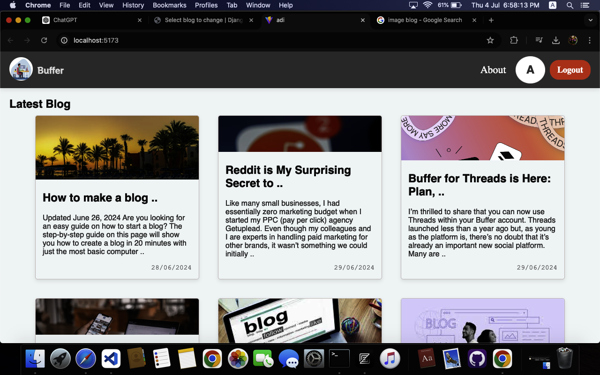

# Web Maestro

Welcome to **Web Maestro**! This project is designed to help you build a versatile and feature-rich blogging platform with a focus on user management and real-time interactions.




## Features

- **User Registration and Login**: Secure authentication for users to create and manage their accounts.
- **Blog Creation and Management**: Users can create, edit, and delete their blog posts.
- **Real-Time Updates**: Instant updates to blog posts and comments with WebSockets.
- **User Presence Status**: Monitor online/offline status of users in real-time.
- **Scalability**: Built with scalability in mind to handle increasing user loads and interactions.

## Getting Started

Follow these instructions to get your development environment set up and running.

### Prerequisites

- Node.js and npm (Node Package Manager)
- A modern web browser

### Installation

1. **Clone the Repository**

   ```bash
   git clone https://github.com/yourusername/web-maestro.git
   ```

2. **Navigate to the Project Directory**

   ```bash
   cd web-maestro
   ```

3. **Install Dependencies**

   ```bash
   npm install
   ```

4. **Start the Application**

   ```bash
   npm start
   ```

   The application should now be running at `http://localhost:3000`.

## Usage

1. **Register a New Account**: Navigate to the registration page and create a new account.
2. **Login**: Use your credentials to log in and access your dashboard.
3. **Create a Blog Post**: Write and publish your blog posts.
4. **Edit and Manage Posts**: Update or delete your existing blog posts.
5. **Real-Time Updates**: See updates to posts and comments in real-time.
6. **Check Presence**: See who’s online and offline in the user list.

## Contributing

We welcome contributions to improve Web Maestro! Please follow these steps to contribute:

1. Fork the repository.
2. Create a new branch for your feature or fix.
3. Commit your changes with descriptive messages.
4. Push your branch and create a pull request.

## License

This project is licensed under the MIT License - see the [LICENSE](LICENSE) file for details.

## Contact

For any questions or support, please contact:

- **Email**: adiworkprofile@gmail.com
- **GitHub Issues**: [GitHub Issues](https://github.com/yourusername/web-maestro/issues)

## Screenshots


Thank you for checking out Web Maestro!


